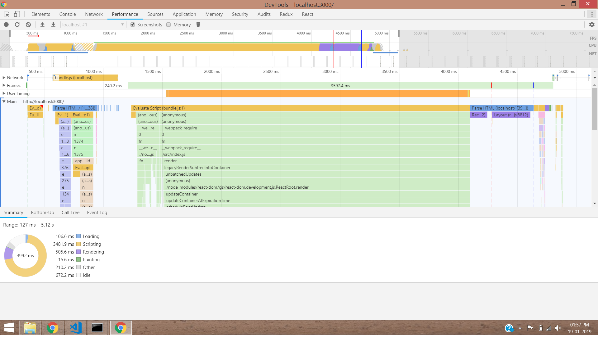
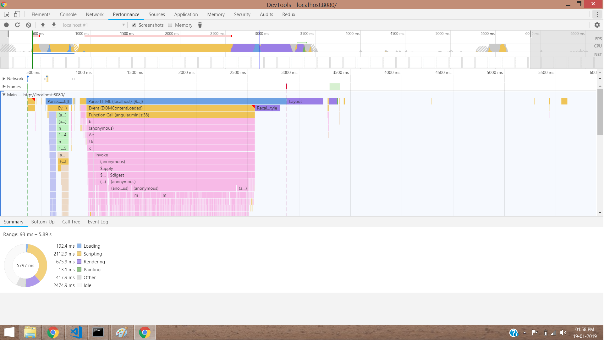

# AngularJS vs React
AngularJs vs React rendering performance comparison

## Machine Configurations:-
<pre>
Processor:    Intel(R) Core(TM) i5-6200U CPU @ 2.30Ghz 2.30 GHz
RAM:          8.00 GB
OS:           64-bit Windows 8.1
</pre>

## Steps to start apps

Download or clone the repo and in respective folders 
```npm install``` (Install the dependencies) and
```npm start``` (Start the server for testing application)

### React Results:-


### AngularJs Results:-

